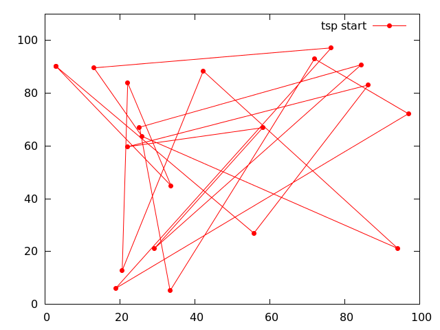
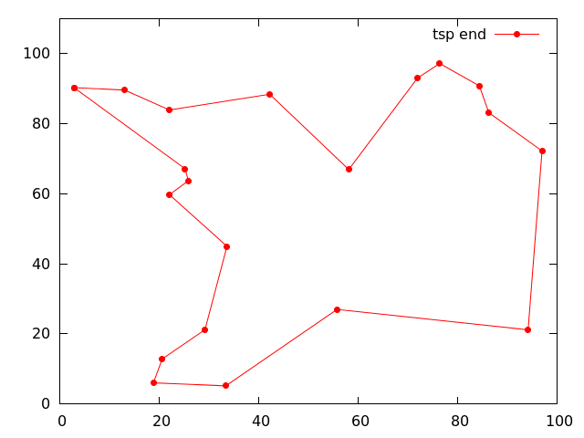

[](https://travis-ci.org/willi-kappler/darwin-rs)
[](./LICENSE)
[](https://docs.rs/darwin-rs/0.5.0/darwin-rs/index.html)
[](https://crates.io/crates/darwin-rs)

# darwin-rs
This library allows you to write evolutionary algorithms (EA) using the [Rust](https://www.rust-lang.org/) programming language.

Version 0.5 (2021.x.y)

**Documentation:** [darwin-rs](https://docs.rs/darwin-rs/0.5.0/darwin_rs/)





The example folder contains these examples:

- TSP (traveling salesman problem): the classic type of problem for EA (see two pictures above).
- Sudoku: a sudoku solver using EA.
- Queens: solving the queens problem with EA. Although not as fast as [this one](https://github.com/reem/rust-n-queens) or [this one](https://github.com/Martin1887/oxigen/tree/master/nqueens-oxigen) ;-)
- OCR: a simple optical character recognition example. Two strings are drawn (rendered) using a truetype font on a image buffer and then a perfect match representing the drawn text is found.

darwin-rs uses [semantic versioning](http://semver.org/)

# Usage:
Add the following to the Cargo.toml in your project:

```toml
[dependencies]
darwin-rs = "0.5"
```


TODO:


# Discussion:
- [Reddit](https://www.reddit.com/r/rust/comments/4nnajh/darwinrs_evolutionary_algorithms_with_rust/)
- [Rust User Forum](https://users.rust-lang.org/t/darwin-rs-evolutionary-algorithms-with-rust/6188)


# Similar crates:
- [genetic-files](https://github.com/vadixidav/genetic-files)
- [RsGenetic](https://github.com/m-decoster/RsGenetic)
- [evo-rs](https://github.com/mneumann/evo-rs)
- [calco-rs](https://github.com/Kerosene2000/calco-rs)
- [GenGen](https://crates.io/crates/GenGen)
- [parasailors](https://github.com/dikaiosune/parasailors)
- [random-wheel-rs](https://github.com/Kerosene2000/random-wheel-rs)
- [roulette-wheel-rs](https://github.com/Kerosene2000/roulette-wheel-rs)
- [differential-evolution-rs](https://github.com/martinus/differential-evolution-rs)
- [evolve-sbrain](https://github.com/LeoTindall/evolve-sbrain)
- [Nodevo](https://github.com/bgalvao/nodevo)
- [Oxigen](https://github.com/Martin1887/oxigen)

Any feedback is welcome!
